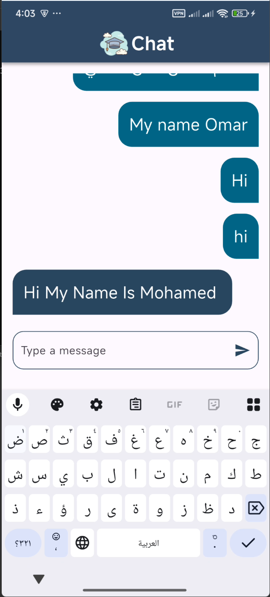

# 🎓 Scholar Chat App

A professional real-time chat application built with **Flutter** and **Firebase**. Scholar Chat provides a seamless messaging experience with a secure authentication system and real-time database integration.

---

## 📸 Screenshots

<p align="center">
  
  
</p>

---

## ✨ Features

- 🔐 **Secure Authentication**: User sign-up and login powered by Firebase Authentication.
- 💬 **Real-time Messaging**: Instant message delivery and updates using Cloud Firestore.
- 🎨 **Modern UI/UX**: Clean, responsive, and intuitive interface designed for a great user experience.
- 📱 **Cross-Platform**: Runs smoothly on both Android and iOS.
- ⚡ **Real-time Synchronization**: Instant data updates across all connected devices.

---

## 🚀 Tech Stack

- **Framework**: [Flutter](https://flutter.dev/)
- **Backend**: [Firebase](https://firebase.google.com/)
    - **Authentication**: Email/Password login.
    - **Database**: Cloud Firestore for real-time data storage.
- **State Management**: Cubit/Provider (Modern Flutter patterns).

---

## 🛠️ Installation

1. **Clone the repository:**
   ```bash
   git clone https://github.com/YOUR_USERNAME/scholar-chat-app.git
   ```

2. **Navigate to the project directory:**
   ```bash
   cd scholar-chat-app
   ```

3. **Install dependencies:**
   ```bash
   flutter pub get
   ```

4. **Firebase Setup:**
   - Create a project on the [Firebase Console](https://console.firebase.google.com/).
   - Add Android/iOS apps and download the `google-services.json` / `GoogleService-Info.plist` files.
   - Or use `flutterfire configure` if you have the CLI installed.

5. **Run the app:**
   ```bash
   flutter run
   ```

---

## 🏗️ Project Structure

```text
lib/
├── models/      # Data models
├── screens/     # UI Pages (Login, Register, Chat)
├── widgets/     # Reusable UI components
├── helper/      # Utility functions & services
└── constants/   # App constants and colors
```

---

## 📝 License

This project is licensed under the MIT License - see the [LICENSE](LICENSE) file for details.

---

<p align="center">Developed with ❤️ by Mohamed Adel</p>

